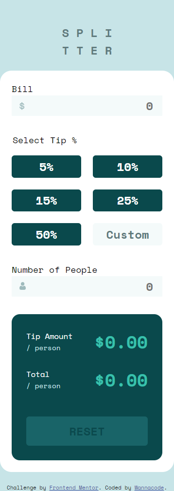
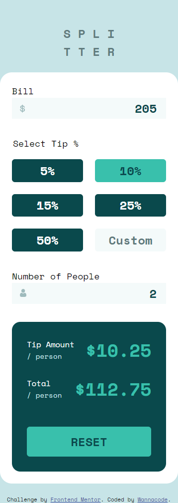

# Frontend Mentor - Tip calculator app solution

This is a solution to the [Tip calculator app challenge on Frontend Mentor](https://www.frontendmentor.io/challenges/tip-calculator-app-ugJNGbJUX). Frontend Mentor challenges help you improve your coding skills by building realistic projects.

## Table of contents

- [Overview](#overview)
  - [The challenge](#the-challenge)
  - [Screenshot](#screenshot)
  - [Links](#links)
- [My process](#my-process)
  - [Built with](#built-with)
  - [What I learned](#what-i-learned)
  - [Continued development](#continued-development)
  - [Useful resources](#useful-resources)
- [Author](#author)
- [Acknowledgments](#acknowledgments)

**Note: Delete this note and update the table of contents based on what sections you keep.**

## Overview

This challenge includes elements of Frontend Mentor's [Interactive Rating Component.](https://www.frontendmentor.io/challenges/interactive-rating-component-koxpeBUmI/hub)

### The challenge

Users should be able to:

- View the optimal layout for the app depending on their device's screen size
- See hover states for all interactive elements on the page
- Calculate the correct tip and total cost of the bill per person

### Screenshot






### Links

- Solution URL: [Solution URL here](https://github.com/kwngptrl/FEM-tip-calculator-app-main)
- Live Site URL: [Live site URL here](https://kwngptrl.github.io/FEM-tip-calculator-app-main/)

## My process

### Built with

- Semantic HTML5 markup
- CSS custom properties
- Flexbox
- CSS Grid
- Mobile-first workflow
- Vanilla JS

### What I learned

When I first downloaded the starter files and looked at it I was wondering why was there no 'submit' button on this. This is essentially a form and there should be a 'submit' button. But as it turns out, this is like some calculator apps out there where it is based on event listeners. So, thinking about it I immediately recognized that a previous challenge can be included here and that was the Interactive Rating Component. It would be used where the user would select the tip in percent, but what about 'custom'?

This is where I fell into the JS rabbit hole. The HTML and CSS were largely done in two days. The JS on the other hand had me reading about IIFEs, closures, nested event listeners (which turned out to be bad practice), roving tabindexes, among other things. What I wanted to happen once I entered the group of radiobuttons was to be able to use the arrow keys to navigate inside it, and then when I get to the last radiobutton named 'custom' it turns into an `<input type='text' />` field.

Originally, I attached event listeners to all elements of the form. Later on, I read about event delegation and decided to use that. There were a lot of tiny little things that had to be tracked like the tabindex, focus, blur, changing the radiobutton checked state from true to false and back, tracking where the cursor/caret was in order for keyboard navigation to work within the radiobutton group, transferring any value there to the radiobutton, and dispatching an event from it when the focus changes to another element to update the result in the result container. Then, if the user pressed the 'reset' button all states, values, and error messages had to be reset or returned to default.

Now that I'm done with this I'm thinking I 'overthinked' too much. Maybe I could've just used 5 radiobuttons and a standard `<input type='text' />`. There would still be the issue of tabindex regardless though, as well as disabling a radiobutton if the 'custom' field is selected and active.

For computing the result and displaying to the result container, I used the following code so that it wouldn't display `NaN` or `Infinity`.
```js
tipAmount.innerText = `\$${(isFinite(tipAmountPerPerson)) ? tipAmountPerPerson.toFixed(2): '0.00'}`;
totalAmount.innerText = `\$${(isFinite(total)) ? total.toFixed(2) : '0.00'}`;
```
It would just display $0.00, the error message would be displayed closest to the input field for bill and/or number of people. For the 'custom' input field within the radiobutton group, entering invalid values would cause the border color of the input field to turn red. Although there is a css ```:invalid``` selector, I didn't like its behavior.
```js
let tip = Number(inputCustom.value);
    if (tip < 0 || tip > 100 || isNaN(tip)) {
            inputCustom.classList.add("invalid");
        } else {
            inputCustom.classList.remove("invalid");
        }
```
```css
.custom-tip.invalid {
    border: 3px solid red;
}
```

### Continued development

I think I could refactor the code some more, but I think it's good enough. I urge anyone to go ahead and play with it both using keyboard navigation,  mouse, or on a smartphone. If anyone has ideas on improving the JS I'm all ears.

### Useful resources

- [HTML5 Form Validation With the “pattern” Attribute](https://webdesign.tutsplus.com/html5-form-validation-with-the-pattern-attribute--cms-25145t) - This is an interesting read, although I did not apply much of what was written.
- [Radio Group Pattern](https://www.w3.org/WAI/ARIA/apg/patterns/radio/#keyboard_interaction) - An article discussing the keyboard behavior of radiobuttons.

## Author

- Frontend Mentor - [@Wannacode](https://www.frontendmentor.io/profile/kwngptrl)'d like to share.**

## Acknowledgments

This is where you can give a hat tip to anyone who helped you out on this project. Perhaps you worked in a team or got some inspiration from someone else's solution. This is the perfect place to give them some credit.

**Note: Delete this note and edit this section's content as necessary. If you completed this challenge by yourself, feel free to delete this section entirely.**
